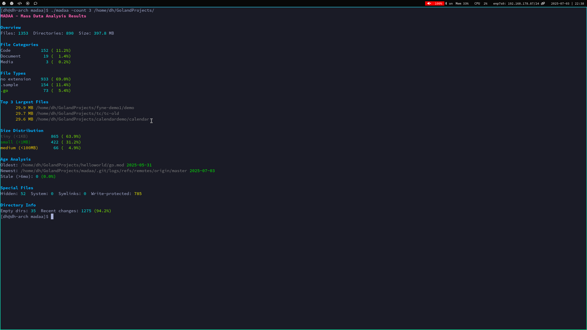

# MADAA - Mass Data Analysis Assistant

MADAA is a command-line tool for quick and comprehensive analysis of directory structures.

## Preview



## Features

- Detailed file type analysis
- Identification of largest files
- Size distribution
- File age analysis
- Detection of special files (hidden, system, symlinks)
- Directory information
- Progress display during analysis
- Configurable file type categories
- Parallel processing for optimal performance
- Color-coded output for better readability

## Installation

```bash
go install github.com/dahead/madaa@latest
```


### Parameters

- `--count N`: Number of top entries to display (default: 10)
- `<directory path>`: Directory to analyze


## Usage

```
$ madaa --count 5 /home/user/
```

### Ausgabe

The analysis shows:

- Overview of total files and sizes
- Top N most common file types
- Top N largest files
- Top N files per type
- Size distribution (tiny to large)
- Age analysis with oldest/newest files
- Special file information
- Directory statistics